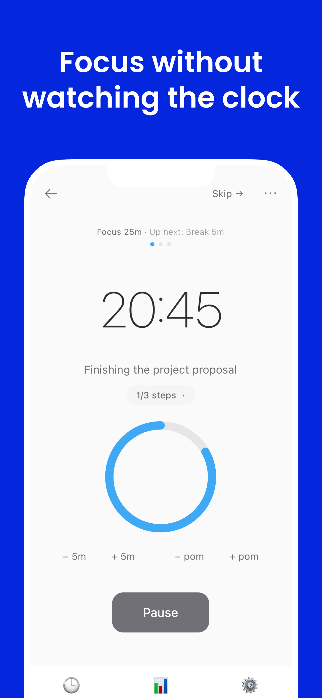
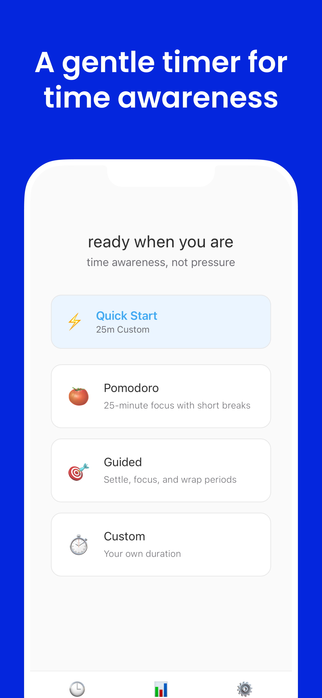
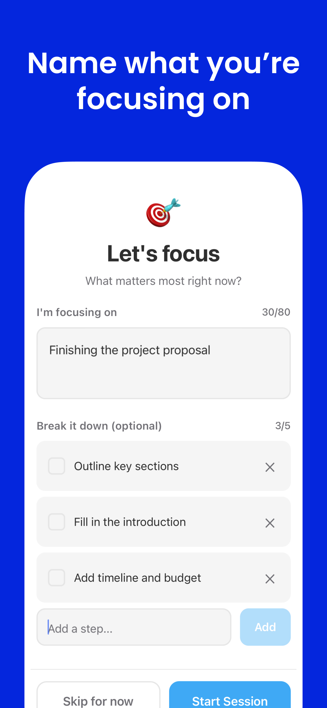
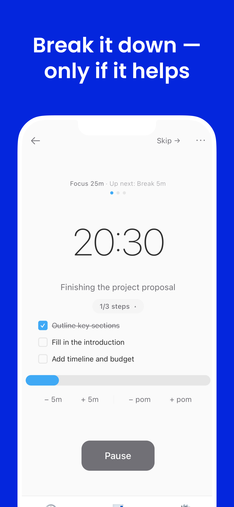
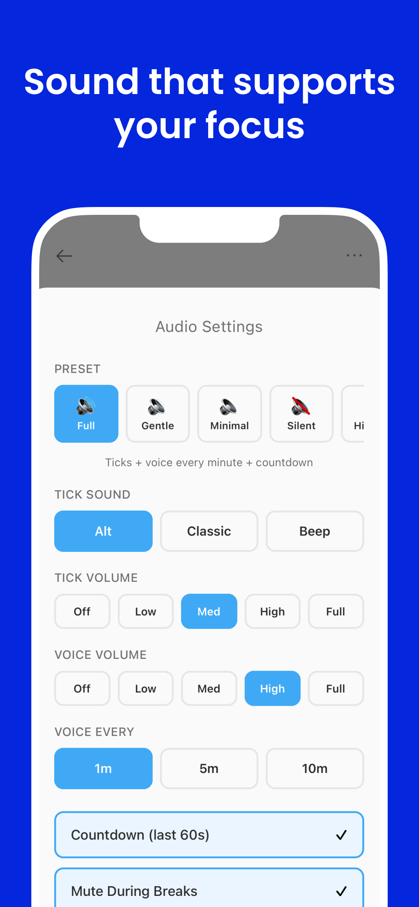

# FlowMate

**An audio-guided focus timer built around a single named intent.**

Live on **[web](https://flowmate.club)** · **[Android](https://play.google.com/store/apps/details?id=club.flowmate.app)** (soft launch, not yet promoted) · iOS in review · ~1,000 web users

---

<table>
  <tr>
    <td></td>
    <td></td>
    <td></td>
    <td></td>
    <td></td>
  </tr>
</table>

---

## The problem with most timers

Every time you glance at a countdown, you've interrupted yourself. The timer is supposed to be invisible infrastructure — instead it's a screen you have to check. FlowMate inverts this: audio cues reach you wherever your attention is. You can run a full session without looking at the screen once.

Each session also starts with a named intent. One thing, written down before the clock starts. That small friction is the product — it forces a moment of clarity that most people skip and later regret.

---

## Flowmato

The app has a companion character: Flowmato, a little tomato who changes state with the session.

<table>
  <tr>
    <td align="center"><br/><sub>Idle</sub></td>
    <td align="center"><br/><sub>Focus</sub></td>
    <td align="center"><br/><sub>Break</sub></td>
    <td align="center"><br/><sub>Done</sub></td>
  </tr>
</table>

Flowmato also grows across sessions — a visual record of accumulated focus time. The progression from seedling to full plant is driven by total completed minutes, not session count.

<video src="apps/web/public/flowmato/progress/flowmato_growing.mp4" controls width="360"></video>

Character state is derived from `timerPhase` — the same single value that drives the audio scheduler and PiP window. Nothing polls Flowmato's state; it just reads the source of truth.

---

## Audio scheduler

This was the core engineering problem. 40+ voice cues have to fire at precise moments across sessions of varying length, across two platforms, without drifting out of sync or coupling to UI event handlers.

The approach: compute whether a cue should fire from elapsed time alone — no stored state, no wired handlers.

```ts
// packages/shared/utils/timerUtils.ts

// Fires on the correct minute boundaries for any announcement interval preset
export const shouldAnnounceMinute = (
  minutes: number,
  interval: 1 | 2 | 3 | 5 | 10
): boolean => {
  return minutes > 0 && minutes <= 24 && minutes % interval === 0;
};

// For sessions > 25 min, dings replace per-minute announcements at 5-min marks
export const shouldPlayDing = (
  seconds: number,
  sessionDuration: number
): boolean => {
  if (sessionDuration <= 25 * 60) return false;
  const minutes = Math.floor(seconds / 60);
  const secs = seconds % 60;
  return secs === 0 && minutes > 0 && minutes % 5 === 0;
};
```

Every tick evaluates these functions against current elapsed time. No cue can "miss" because there's nothing to miss — the scheduler re-derives the correct cue set from scratch on each tick. Adding a new cue type means adding one predicate function. There are no chains of event handlers to trace, no side effects to audit.

Five audio presets (Full → Gentle → Minimal → Silent → Hi-Fi) sit above the scheduler as a density filter. Switching presets doesn't touch the scheduler or reload audio — it changes which cues pass through.

---

## Session model

Sessions have three terminal states:

| Status | Condition | Counted in stats |
|---|---|---|
| `completed` | Timer reached zero | Yes |
| `partial` | Stopped early, ≥ 1 min elapsed | Yes |
| `skipped` | Stopped early, < 1 min elapsed | No |

The `partial` vs `skipped` distinction matters for focus time accuracy. A session started and immediately cancelled shouldn't pad your stats, but one you genuinely worked through — even incompletely — should. The 1-minute threshold is a judgment call that's tuned to feel right in practice.

Sessions are stored client-side only (localStorage on web, AsyncStorage on mobile), retained 90 days, and never leave the device.

---

## Architecture

### Monorepo

```
flowmate/
├── apps/
│   ├── web/      # Next.js — Document PiP API, HTML5 Audio
│   └── mobile/   # React Native (Expo) — native audio, push notifications
└── packages/
    └── shared/   # Timer logic, audio scheduler, session types, stats utils
```

Web and Android share all business logic via `@flowmate/shared`. The shared package owns:
- Timer segment configuration (Pomodoro, Guided Deep Work)
- Audio cue scheduler (`shouldAnnounceMinute`, `shouldPlayDing`, and related predicates)
- Session lifecycle types and stats utilities

Platform-specific code handles only rendering and native APIs — `expo-audio` on mobile, HTML5 Audio on web; native push notifications on mobile, Document PiP API on web. The same session recorded on either platform will produce identical stats.

### State

On web, `timerPhase` lives in `page.tsx` and flows down as props — no Context API. On mobile, `TimerContext` wraps the navigator. Both share the same session model from `@flowmate/shared`. This was intentional: keeping web state at the root makes the data flow easy to trace and avoids the debugging overhead of context updates that don't obviously connect to their source.

---

## What I'd do differently

**Cue density should adapt to session length automatically.** A 5-minute sprint and a 90-minute deep work block have different rhythms. Right now density is a manual preset — it should be a function of duration.

**The partial/skipped threshold (1 min) is a guess.** It feels right but there's no data behind it. This should be measured: what threshold correlates with sessions users actually report as meaningful?

**Adaptive cues based on step progress.** When focus steps are tracked, audio cues could acknowledge completion ("you've finished 2 of 4 steps") rather than only marking elapsed time. The data is there; it just isn't wired to the scheduler yet.

**Measure audio-only vs. audio + visual.** The working hypothesis is that audio is primary and Flowmato is additive. That needs to be tested, not assumed.

---

## Stack

| | |
|---|---|
| Web | Next.js 16, React 19, TypeScript, Tailwind CSS |
| Mobile | React Native, Expo 54 |
| Shared logic | Turborepo monorepo (`@flowmate/shared`) |
| Audio | HTML5 Audio API (web), expo-audio (mobile), ElevenLabs TTS |
| PiP | Document Picture-in-Picture API — Chrome/Edge only |
| AI | OpenAI (focus step generation), Claude |

---

## Running it

```bash
npm install

npm run dev:web     # Next.js on localhost:3000
npm run dev:mobile  # Expo — requires Expo CLI and Expo Go
```

Node 18+. For mobile native builds: `npm run android` or `npm run ios` from the repo root.

---

Full write-up: [lydiakwag.com/projects/flowmate](https://www.lydiakwag.com/projects/flowmate)
